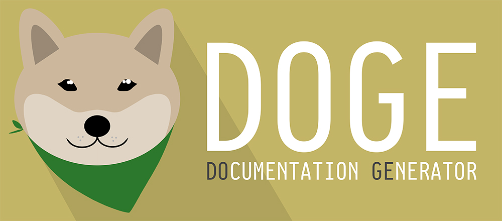

<p align="center">
  
</p>
<p align="center">
  <a href="https://travis-ci.com/kkoomen/doge">
    
  </a>
  
  
  <a href="https://github.com/kkoomen/doge/blob/develop/LICENSE">
    
  </a>
</p>

> Any fool can write code that a computer can understand. Good programmers write
> code that humans can understand. -- Martin Fowler, 1999

We all love documentation because it makes our codebases easier to understand,
yet no one has time to write it in a good and proper way.

DoGe is a [Do]cumentation [Ge]nerator which will generate a proper documentation
skeleton based on certain expressions (mainly functions). Simply put your cursor
on a function, press `<C-d>`(<kbd>Ctrl</kbd> + <kbd>d</kbd>), jump quickly
through TODO items using `<Tab>` and `<S-Tab>` to quickly add descriptions and
go on coding!

# Table of Contents
- [Table of Contents](#table-of-contents)
- [Supported languages and doc standards](#supported-languages-and-doc-standards)
- [Getting started](#getting-started)
- [Configuration](#configuration)
    + [`g:doge_mapping`](#gdoge_mapping)
    + [`g:doge_mapping_comment_jump_forward`](#gdoge_mapping_comment_jump_forward)
    + [`g:doge_mapping_comment_jump_backward`](#gdoge_mapping_comment_jump_backward)
    + [`g:doge_comment_todo_suffix`](#gdoge_comment_todo_suffix)
    + [`g:doge_comment_interactive`](#gdoge_comment_interactive)
- [Contributing](#contributing)
  * [Linting](#linting)
  * [Documentation](#documentation)
- [Help](#help)
- [Motivation](#motivation)

# Supported languages and doc standards

Every language that has a documentation standard should be supported by DoGe.
Is your favorite language not supported?
[Make a feature request](https://github.com/kkoomen/doge/issues/new?assignees=&labels=enhancement&template=feature_request.md&title=Add+support+for+<language>) :tada:

|                    | Language                                       | Doc standard                                                                      |
| ---                | ---                                            | ---                                                                               |
| :white_check_mark: | Python                                         | ([Sphinx reST](http://daouzli.com/blog/docstring.html#restructuredtext))          |
| :white_check_mark: | PHP                                            | ([phpdoc](https://www.phpdoc.org))                                                |
| :white_check_mark: | JavaScript (Including: ES6, FlowJS and NodeJS) | ([JSDoc](https://jsdoc.app))                                                      |
| :white_check_mark: | TypeScript                                     | ([JSDoc](https://jsdoc.app))                                                      |
| :white_check_mark: | CoffeeScript                                   | ([JSDoc](https://jsdoc.app))                                                      |
| :white_check_mark: | Lua                                            | ([LDoc](https://github.com/stevedonovan/LDoc))                                    |
| :white_check_mark: | Java                                           | ([JavaDoc](https://www.oracle.com/technetwork/articles/javase/index-137868.html)) |
| :white_check_mark: | Groovy                                         | ([JavaDoc](https://www.oracle.com/technetwork/articles/javase/index-137868.html)) |
| :white_check_mark: | Ruby                                           | ([YARD](https://www.rubydoc.info/gems/yard/file/docs/Tags.md))                    |
| :white_check_mark: | Scala                                          | ([ScalaDoc](https://docs.scala-lang.org/style/scaladoc.html))                     |
| :white_check_mark: | Kotlin                                         | ([KDoc](https://kotlinlang.org/docs/reference/kotlin-doc.html))                   |
| :white_check_mark: | R                                              | ([Roxygen2](https://github.com/klutometis/roxygen))                               |

# Getting started

Install `DoGe`:

Using vim-pack:

- `git clone https://github.com/kkoomen/doge ~/.vim/pack/*/start/doge`

Using pathogen:

- `git clone https://github.com/kkoomen/doge ~/.vim/bundle/doge`

Using plug:

- `Plug 'kkoomen/doge'`

# Configuration

Run `:help doge` to get the full help page.

### `g:doge_mapping`

(Default: `<C-d>`)

Sets the mapping to trigger DoGe.

### `g:doge_mapping_comment_jump_forward`

(Default: `<Tab>`)

The mapping to jump forward to the next TODO item in a comment. Requires
`g:doge_comment_interactive` to be enabled.

### `g:doge_mapping_comment_jump_backward`

(Default: `<S-Tab>`)

The mapping to jump backward to the next TODO item in a comment. Requires
`g:doge_comment_interactive` to be enabled.

### `g:doge_comment_todo_suffix`

(Default: `1`)

Adds the TODO suffix after every generated parameter.

### `g:doge_comment_interactive`

(Default: `1`)

Jumps interactively through all TODO items in the generated comment.

# Contributing

Help or feedback is always appreciated. If you find any bugs, feel free to
[submit a bug report](https://github.com/kkoomen/doge/issues/new?labels=bug&template=bug_report.md).
If you think DoGe can be improved, feel free to submit a
[feature request](https://github.com/kkoomen/doge/issues/new?assignees=&labels=enhancement&template=feature_request.md)
or a pull request.

## Linting

Your pull request should follow the rules of the `vim-vint` linter which is a
must to keep the code clean and prevent mistakes being made. Each PR will
automatically run tests for code quality using Vint. You don't have to use Vint
locally, but it will help you to fix any errors before submitting a PR.

- `pip3 install vim-vint`

If you use [ALE](https://github.com/w0rp/ale) (recommended)

```
let g:ale_linters = { 'vim': ['vint'] }
```

or if you use [Syntastic](https://github.com/vim-syntastic/syntastic)
```
let g:syntastic_vim_checkers = ['vint']
```

## Documentation

Every function, mapping or configurable option should contain documentation. The
documentation in the `doc/doge.txt` should be generated using
[vimdoc](https://github.com/google/vimdoc).

If you change the `doc/doge.txt` you also have to update the helptags file
located in `doc/tags`. You can do this by running:
`:helptags ~/.vim/path/to/doge/doc/`.

# Help

To open all the help pages, run `:help doge`.

# Motivation

I created DoGe mainly because I couldn't find a plugin that could generate
proper comments for a big collection of languages in a quick and easy way. I am
a polyglot developer when it comes to programming languages and I couldn't find
proper vim plugins that would generate documentation quickly for all languages I
did want to be supported.

Rather then scraping off the internet to find all sorts of vim plugins for every
language I was coding in, I did want a single plugin that would support every
language I was working in.

Another big motivation for me is that I've noticed people tend to skip the
documentation part because writing _just the skeleton_ of the comment takes
already too much time and I am one of those people. Having the skeleton
generated and an interactive mode to quickly add descriptions is a big
time saver.

# How does DoGe work?

The key to DoGe is _regex_. Why? Because of its flexibility. Each filetype
consists of a buffer-local variable named `b:doge_patterns` which is a list of
dictionaries containing info about a certain pattern to apply for when
triggering DoGe.

In each pattern you can specify a regex pattern and each group can be named and
then be used inside the `template` key to render that value when it matches.
After implementating this the only thing left to do was implementing all the
languages.

# License

DoGe is licensed under the GPL-3.0 license.
